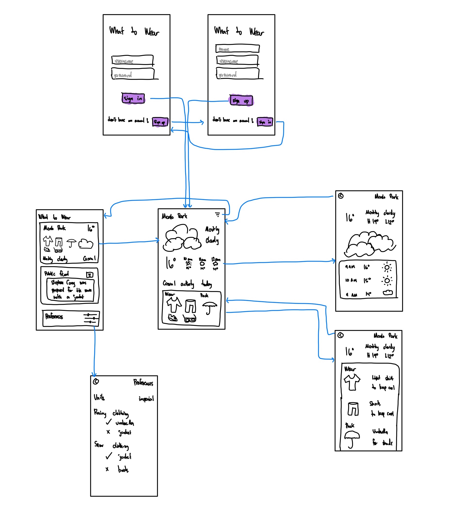

# WhatToWear

## Table of Contents
1. [Overview](#Overview)
2. [Product Spec](#Product-Spec)
3. [Wireframes](#Wireframes)

## Overview

### Description

This app will allow users to easily pick the optimal clothing they should wear and pack given the weather at their current location, destination location (if provided) and the type of activity they plan to do. Users can set their own preferences such as a preference of rain jackets over umbrellas, as well as the activity they plan to do, such as workout after working at the office. Based on all this information, the app will provide the user with personalized clothing suggestions to wear and bring.

### App Evaluation
- **Category:** Lifestyle / Weather
- **Mobile:** The app is suited for mobile use since it gives users easy access to see their clothing recommendations daily.
- **Story:** Users get suggestions on what clothing to wear and carry based on their local weather and the type of activity they plan to do.
- **Market:** Anyone that wants to easily pick optimal clothes to wear can enjoy this app.
- **Habit:** Users can check the app daily on what to wear for the given day.
- **Scope:** The app will remain focused on the core feature of providing personalized clothing suggestions based on the weather and type of activity.

## Product Spec

**Required Must-have Stories**

* [ ] User can view weather information at their location from the OpenWeather API
* [ ] User can tap on weather information for more detailed information about it
* [ ] User can set type of activity they plan to do during the day
  * [ ] User can search either work, business, casual, workout, or a combination of them
  * [ ] User’s chosen activity is saved
* [ ] User can view personalized clothing suggestions based on location and type of activity
  * [ ] User can view what kind of shirt, jacket, pants/shorts, shoes to wear
  * [ ] User can view what kind of accessory (rain jacket, umbrella, hat, sunglasses, extra set of workout clothes, sports shoes) to bring
  * [ ] User can view the clothing as graphical icons
* [ ] User can double tap to get detailed information about what to wear and bring
* [ ] User can see rain/snow animation in the background which changes depending on the strength of the rain/snow
* [ ] User can set unit of temperature
* [ ] User can sign up with a new account or log in with existing account, and sign out of their account
* [ ] User gets auto-logged in the app if user was previously logged in for an indefinite period of time
* [ ] User can save preferences 
  * [ ] User can save preferences like umbrella over rain jacket and preferred temperature units
  * [ ] User can save clothing types that they own (eg no sunglasses or hat)

**Optional Nice-to-have Stories**
* [ ] User can open the app offline and see last loaded weather information
* [ ] User can set destination location and get more information using it
  * [ ] User can view destination weather information
  * [ ] User can view clothing suggestions based on current and destination location
* [ ] User can save common origin and destination locations (eg, home and work), which can then be selected when setting origin/destination locations
* [ ] User can receive push notifications every morning on automatic clothing suggestions
* [ ] User can share what they wore to a public feed
* [ ] User can view a public feed of what other users wore
* [ ] User can swipe down to refresh both weather information and current location
* [ ] User can see app icon on home screen
* [ ] User gets onboarding guide on first time logging into the app
* [ ] User can use application as a guest without logging in/creating an account
* [ ] User can see a transition animation when going to and from the menu screen

### 2. Screen Archetypes

* Login screen
  * Users are able to login into the application
* Registration screen
  * Users are able to sign up to the application
* Dashboard screen 
  * User can see weather and clothing overview
  * User can set type of activity
* Menu screen
  * User can select going to the dashboard, feed (optional), and preferences screen
* Detailed weather screen
  * User can see detailed weather information
* Detailed clothing screen
  * User can see detailed clothing information
* Preferences screen
  * Users can set preferences and view profile information
  * User can logout
* Public feed page (optional)
  * Post and view clothing worn by users

### 3. Navigation

**Tab Navigation** (Tab to Screen)

* None (chose to use a menu screen)

**Flow Navigation** (Screen to Screen)

* Login screen
  * Dashboard screen
* Registration screen
  * Dashboard screen
* Dashboard screen 
  * Detailed weather screen
  * Detailed clothing screen
  * Menu screen
* Menu screen
  * Dashboard screen
  * Public feed page (optional)
  * Preferences screen
* Detailed weather screen
  * Dashboard screen
* Detailed clothing screen
  * Dashboard screen
* Preferences screen
  * Menu screen
  * Sign in screen
* Public feed page (optional)
  * Menu screen

## Wireframes

